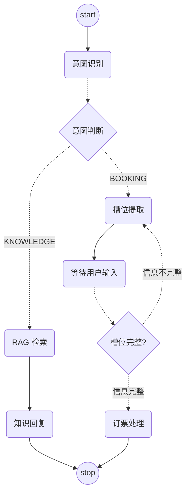

# Issue Clarify Graph Example - 问题澄清工作流示例

本示例展示了如何使用 Spring AI Alibaba Graph 构建一个具有**意图识别**、**槽位提取**和 **Human in the Loop（人机交互）** 能力的机票客服智能体。

## 功能概述

这是一个机票预订客服系统，具备以下能力：

1. **意图识别**：自动识别用户意图（机票预订 / 知识问答）
2. **知识问答**：基于 RAG 检索知识库回答用户问题
3. **槽位提取**：从用户输入中提取预订所需信息（出发日期、出发城市、到达城市）
4. **多轮对话**：信息不完整时自动追问，引导用户补充槽位信息
5. **Human in the Loop**：工作流在等待用户输入时自动中断，用户响应后恢复执行

## 工作流架构



### 节点说明

| 节点 | 类型 | 功能描述 |
|------|------|----------|
| IntentNode | 意图识别 | 使用 LLM 判断用户意图：BOOKING（预订）或 KNOWLEDGE（问答） |
| RagNode | RAG 检索 | 从 DashScope 知识库检索相关文档 |
| KnowledgeReplyNode | 知识回复 | 根据检索结果生成知识问答回复 |
| ClarifyNode | 槽位提取 | 使用 LLM 提取/补充预订槽位信息 |
| ClarifyWaitNode | 中断等待 | Human in the Loop 节点，等待用户补充信息 |
| OrderNode | 订票处理 | 槽位完整后执行模拟订票 |

## 快速开始

### 前置条件

- Java 17+
- Maven 3.6+
- DashScope API Key
- DashScope 知识库（用于 RAG）

### 配置

编辑 `src/main/resources/application.yml`：

```yaml
server:
  port: 10000

spring:
  application:
    name: issue-clarify-example
  ai:
    dashscope:
      index-name: your_knowledge_index_name  # 替换为你的知识库索引名
      api-key: ${DASHSCOPE_API_KEY}          # 建议使用环境变量
```

### 运行

```bash
# 方式一：Maven 运行
cd spring-ai-alibaba-graph-example/issue-clarify-graph-example
mvn spring-boot:run

# 方式二：打包运行
mvn clean package -DskipTests
java -jar target/issue-clarify-graph-example-*.jar
```

### 接口测试

#### 场景一：知识问答

```http
GET http://localhost:10000/booking/call?query=退票要收多少手续费&chatId=chat-001
```

响应示例：
```
根据机票类型不同，退票手续费如下：
- 全价票：起飞前24小时以上收取5%，起飞前2-24小时收取10%...
```

#### 场景二：机票预订（多轮对话）

**第一轮 - 用户表达预订意图，信息不完整：**
```http
GET http://localhost:10000/booking/call?query=我要订机票&chatId=chat-002
```

响应：
```
好的，请问您计划哪天从哪个城市出发，要去哪个城市呢？
```

**第二轮 - 用户补充部分信息：**
```http
GET http://localhost:10000/booking/call?query=明天从北京出发&chatId=chat-002
```

响应：
```
好的，您是从北京出发，请问要去哪个城市呢？
```

**第三轮 - 用户补充完整信息：**
```http
GET http://localhost:10000/booking/call?query=去上海&chatId=chat-002
```

响应：
```
✅ 订票成功！

订单号：ORDER_A1B2C3D4
出发：北京
到达：上海
日期：2025-12-15T14:00

祝您旅途愉快！
```

## 核心实现

### 1. 图配置 (GraphConfig.java)

```java
StateGraph graph = new StateGraph(keyStrategyFactory)
    .addNode("_intent_node_", node_async(intentNode))
    .addNode("_rag_node_", node_async(ragNode))
    .addNode("_knowledge_reply_node_", node_async(knowledgeReplyNode))
    .addNode("_clarify_node_", node_async(clarifyNode))
    .addNode("_clarify_wait_node_", clarifyWaitNode)
    .addNode("_order_node_", node_async(orderNode))
    .addEdge(START, "_intent_node_")
    .addConditionalEdges("_intent_node_",
        edge_async(state -> state.value("intent", String.class).orElse("KNOWLEDGE")),
        Map.of("KNOWLEDGE", "_rag_node_", "BOOKING", "_clarify_node_"))
    .addEdge("_clarify_node_", "_clarify_wait_node_")
    .addConditionalEdges("_clarify_wait_node_", edged,
        Map.of("back", "_clarify_node_", "next", "_order_node_"))
    // ...
```

### 2. Human in the Loop (ClarifyWaitNode.java)

实现 `InterruptableAction` 接口，在槽位不完整时中断工作流：

```java
public class ClarifyWaitNode implements AsyncNodeActionWithConfig, InterruptableAction {
    @Override
    public Optional<InterruptionMetadata> interrupt(String nodeId, OverAllState state, RunnableConfig config) {
        // 槽位完整或是恢复执行时，不中断
        if (isResume || "2".equals(slotParams.status())) {
            return Optional.empty();
        }
        // 否则中断，等待用户输入
        return Optional.of(InterruptionMetadata.builder(nodeId, state)
                .addMetadata("reply", slotParams.reply())
                .build());
    }
}
```

### 3. 会话状态管理 (GraphController.java)

使用 `MemorySaver` 保存会话状态，支持多轮对话：

```java
// 检查是否有历史状态
compiledGraph.stateOf(config)
    .map(snapshot -> resumeFromCheckpoint(snapshot, query, config))
    .orElseGet(() -> startNewConversation(query, config));
```


## 相关链接

- [Spring AI Alibaba 官网](https://java2ai.com)
- [Spring AI Alibaba GitHub](https://github.com/alibaba/spring-ai-alibaba)
- [DashScope 控制台](https://dashscope.console.aliyun.com/)
